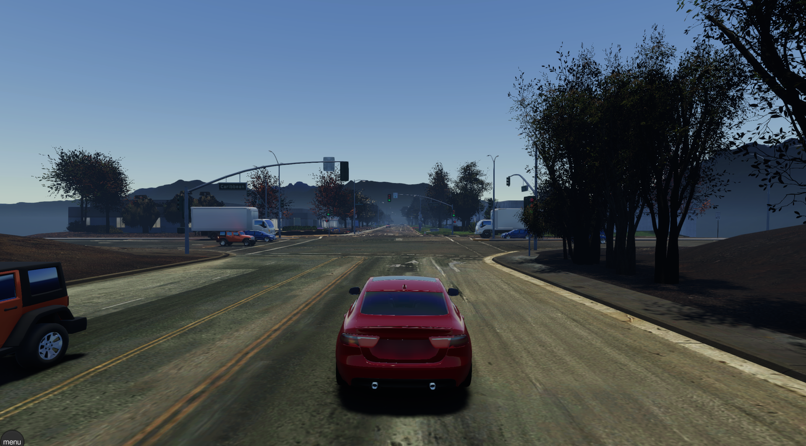
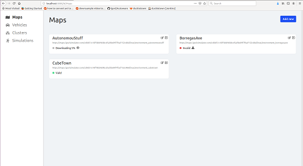
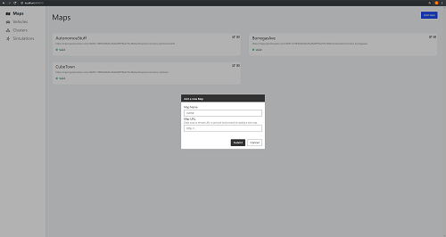
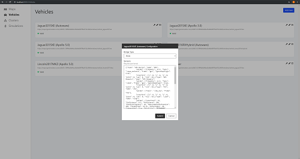
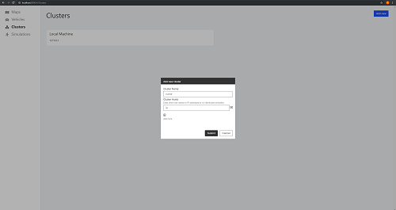
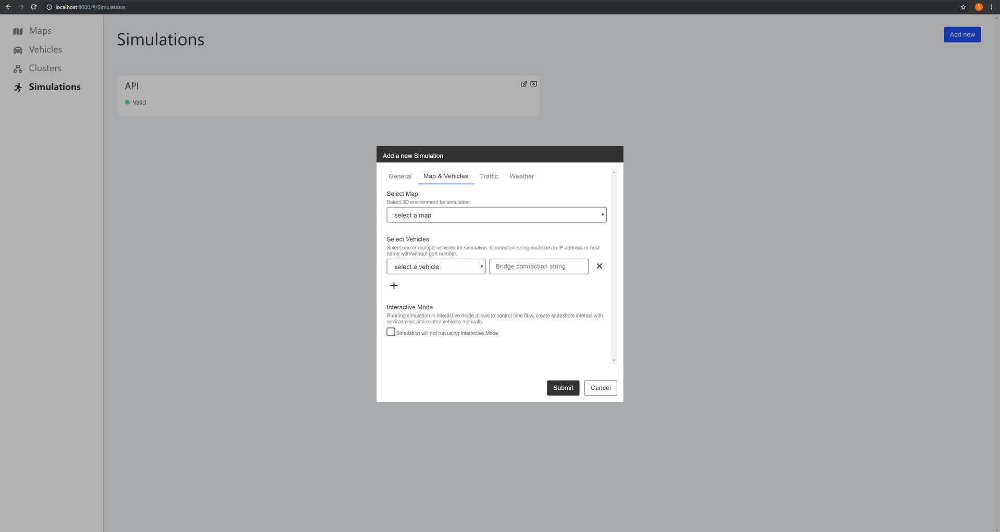

这里主要介绍下Lgsvl这款仿真器，它是由LG电子美国研发中心基于Unity开发的适用于自动驾驶开发者的多机器人模拟器。可以直接和Autoware和Apollo进行对接，同时还提供生成高精度地图。只需要做很小的集成就可以用来测试和验证整个自动驾驶系统。  
下面是Lgsvl中正在测试的自动驾驶车辆。  
  

## 系统配置
仿真器需要渲染整个自动驾驶所需要的环境，为了保证足够的帧率，对系统的配置要求如下。  
* 4GHz四核CPU
* Nvidia GTX 1080 (8GB memory)
* Windows 10 64 bit
对于操作系统采用windows更好，如果是linux也可以运行，效率可能会低一点。  

有2种方式来运行仿真器，一种是直接下来编译好的二进制文件，另外也可以自己下载源码后进行编译。后一种方式在你需要做一定的定制开发的时候，比较有用，如果你只是想尝试下这款仿真器，可以直接下载最新的发布[版本](https://github.com/lgsvl/simulator/releases/tag/2020.05)  

如果Apollo或者Autoware和仿真器在一台主机上运行，那么至少要求10G以上的GPU内存。  

如果Apollo或者Autoware在不同的系统上运行，那么需要系统直接是前兆的网络进行连接，最好通过前兆的交换机进行连接。  

## 下载并且运行
1. 下载最新发布的仿真器文件，你可以选择Windows版本或者Linux版本，通过[链接](https://github.com/lgsvl/simulator/releases/latest)  
2. 确认最新的NVIDIA驱动已经安装。  
* Windows  
    - * 打开"NVIDIA GeForce Experience"
    - * 找到"驱动"选项
    - * 查找更新
    - * 下载并且更新驱动
    - * 或者手动从[英伟达官网](https://www.nvidia.com/Download/index.aspx)下载驱动  
* linux  
    - * 添加图形驱动[PPA](https://launchpad.net/~graphics-drivers/+archive/ubuntu/ppa)  
    - * 打开"Software & Updates"
    - * 找到"Additional Drivers"选项
    - * 选择最新的NVIDIA驱动
    - * 安装"libvulkan"，通过命令"sudo apt install libvulkan1"
3. 解压下载好的仿真器可执行文件，并且运行。  

#### 从源码编译运行
如果你需要从源码编译运行仿真器，你可以参考这个[链接](https://www.lgsvlsimulator.com/docs/build-instructions/)  


## 仿真器介绍
1. 启动仿真器之后，你会看见“打开浏览器”的按钮，点击按钮之后会出现web界面。  
2. 在侧边栏选择仿真器，并且选择需要运行的地图和车辆。一个推荐的配置是地图选择"BorregasAve"，车辆选择"Jaguar2015XE (Apollo 5.0)"，然后点击运行。
3. 车辆将出现在选择好的仿真地图中，你可以通过快捷键(← ↑ ↓ → )来控制车辆，并且切换视角，完整的快捷键在[这里](https://www.lgsvlsimulator.com/docs/keyboard-shortcuts/)  
4. 如果需要和autoware、Apollo系统一起仿真，可以分别参考[autoware](https://github.com/lgsvl/Autoware)和[apollo5.0](https://github.com/lgsvl/apollo-5.0)  

## Web仿真器配置界面
在上述仿真器启动流程中，点击打开浏览器，会出现Web配置管理界面，在这里我们详细介绍下如何配置仿真器。Web界面见下图所示，一共有4个配置选项"地图、车辆、集群、仿真器"。  
  


下面我们依次看下如何配置这4个选项，首先我们查看地图。  
#### 地图
比较简单的方法是直接下载编译好的地图，目前编译好的地图发布在[content website](https://content.lgsvlsimulator.com/maps/), 提供的地图分为2部分，一部分是仿真器中负责渲染的地图，这个地图在Web界面种设置，还有一个部分是高精度地图，这是自动驾驶系统所需要的，放在对应的自动驾驶系统地图目录中。  

增加新地图，点击"Add new"按钮添加新地图，输入地图名称，以及地图所在的位置，这里有2种方式，一种是直接添加对应的url并且下载，另一种是手动下载地图到本地，然后选择对应的本地文件。  
  

#### 车辆
添加车辆和添加地图类似，和地图不同的是，车辆新增加了配置信息，这些配置信息主要是车辆自带的传感器配置和对应的频率、位置、topic信息等。  
  

下面是雷达传感器的配置示例。  
```
  {
    "type": "Lidar",
    "name": "Lidar",
    "params": {
      "LaserCount": 32,
      "MinDistance": 0.5,
      "MaxDistance": 100,
      "RotationFrequency": 10,
      "MeasurementsPerRotation": 360,
      "FieldOfView": 41.33,
      "CenterAngle": 10,
      "Compensated": true,
      "PointColor": "#ff000000",
      "Topic": "/points_raw",
      "Frame": "velodyne"
    },
    "transform": {
      "x": 0,
      "y": 2.312,
      "z": -0.3679201,
      "pitch": 0,
      "yaw": 0,
      "roll": 0
    }
  },
```
全部车辆传感器的配置参数示例可以[参考](https://www.lgsvlsimulator.com/docs/sensor-json-options/)  


#### 集群
集群的配置非常简单，默认集群在本地，也就是"localhost"，也可以修改IP为远端，即通过web修改远端的仿真器配置。
  

#### 仿真器
配置好上述配置之后，就可以配置仿真器了，点击"Add new"添加新的仿真器。一共有"General"、"Map & Vehicles"、"Traffic"、"Weather"4个选项。下面我们来逐步介绍这4个选项。  
  

**General**  
* Simulation Name - 仿真器名称，用户自定义
* Select Cluster - 选择仿真器集群，默认集群即可
* API Only - 当选择为API Only时，只能python API来控制仿真器，python API的介绍可以[参考](https://www.lgsvlsimulator.com/docs/python-api/)  
* Headless Mode - 是否渲染画面，可以选择不渲染现实仿真器画面，占用的系统资源会变少。  

**Map & Vehicles**  
* Interactive Mode - 手动控制汽车模式
* Select Map - 选择地图，即地图选项中已经添加好的地图
* Select Vehicle - 选择车辆，如果需要和apollo系统做对接，还需要添加apollo进行桥接的IP和端口到"Bridge Connection String"中，默认为"localhost:9090"。
* + - 可以选择添加多辆自动驾驶仿真汽车在地图中。

**Traffic**  
* Use Predefined Seed - 生产随机数种子
* Enable NPC - 仿真器种是否包含NPC
* Enable Pedestrians - 仿真器中是否有行人

**Weather**  
* Time of Day - 当前的时间
* Rain - 是否下雨，雨的大小在0-1之间，0是没有，1是最大
* Wetness - 是否起风，风的大小在0-1之间，0是没有，1是最大
* Fog - 是否起雾，雾的大小在0-1之间，0是没有，1是最大
* Cloudiness - 是否有云，云的多少在0-1之间，0是没有，1是最大

至此，仿真器端的配置就完成了，下面在看下Apollo侧如何进行方针。  

## Apollo侧
Apollo侧的编译和安装这里就不介绍了，下面主要介绍如何和仿真器进行对接。  
1. 下载对应的高精度地图到"apollo/modules/map/data"目录中
2. 添加桥接部分的代码(bridge.sh)

## 和仿真器对接过程
执行完成上述部署之后，apollo侧的准备工作就已经完成了，下面我们主要看下如何利用仿真器和Apollo进行对接。  


#### 启动仿真器
1. 启动仿真器，点击打开web界面
2. 在web界面中选择添加好的仿真器（已经选择好对应的地图和车，以及和apollo进行桥接的端口"localhost:9090"）
3. (可选)选择是否添加NPC车辆和行人
4. (可选)选择天气情况
5. 启动仿真器

#### 启动apollo
1. 运行"bootstrap.sh"启动dreamview
2. 运行"bridge.sh"启动桥接器
3. 在dreamview中选择地图和车，这里选择的地图要和仿真器中的地图一致。打开Localization, Transform, Perception, Traffic Light, Planning, Prediction, Routing和Control模块。  
4. 在Route Editing选择routing路径，并且提交。  
5. 查看仿真器中的汽车运行状态。  


